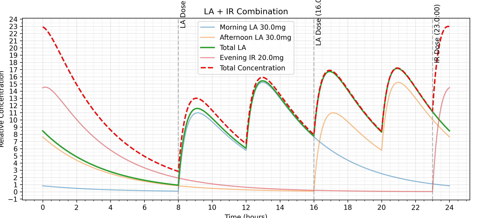
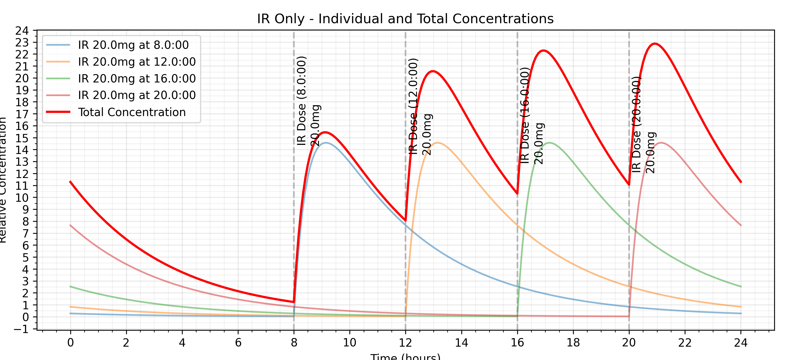

# Ritalin Concentration Calculator

A Python application that visualizes the concentration curves of different Ritalin (Methylphenidate) dosing schedules over a 24-hour period. The application models both Long-Acting (LA) and Immediate Release (IR) formulations, including residual effects from the previous day.

Written to help me with getting my dose timings correct over the course of a day, and making sure I'm not getting points where the ritalin reaches too high a level for me.

This is not meant as medical advice, and this is a personal project only.

## Features

- Interactive GUI for adjusting doses and timing
- Two different dosing schedules:
  1. LA + IR Combination: Two LA doses with optional evening IR
  2. IR Only: Four IR doses throughout the day
- Real-time graph updates
- Automatic saving of last used settings
- Visualization of:
  - Individual dose contributions
  - Total concentration curves
  - Dosing time markers
- Residual effects from previous day included

## example output

This was to graph how I'd take 2xLA, and end up with a similar profile to 4x20mg (+1 10mg float) ritalin a day

4x20mg (+1 10mg float), what I was on before



## Installation

1. Create a virtual environment: 

```bash
# Windows
python -m venv venv
venv\Scripts\activate

# macOS/Linux
python3 -m venv venv
source venv/bin/activate
```

2. Install requirements:

```bash
pip install -r requirements.txt
```

## Usage

1. Run the application:

```bash
python ritalin_ui.py
```

2. Use the interface to:
   - Switch between LA+IR and IR-only tabs
   - Adjust dosages (in mg)
   - Set dosing times (24-hour format)
   - Click "Update Graphs" to see changes
   - Close window to save settings

## Dosing Schedules

### LA + IR Combination
- Morning LA dose (default: 30mg at 8:00)
- Afternoon LA dose (default: 30mg at 16:00)
- Optional evening IR dose

### IR Only
- Four customizable IR doses throughout the day
- Default times: 8:00, 13:00, 18:00, 23:00

## Technical Details

- Uses a pharmacokinetic model combining absorption and elimination phases
- LA formulation modeled as biphasic release (50% immediate, 50% delayed)
- Includes half-life calculations
- Accounts for bioavailability and distribution

## Files

- `ritalin_ui.py`: Main GUI application
- `ritalin_concentration.py`: Pharmacokinetic modeling
- `requirements.txt`: Python dependencies
- `ritalin_settings.json`: Saved user settings (auto-generated)

## Dependencies

- numpy
- matplotlib
- scipy
- tkinter (usually comes with Python)

## Notes

This is a simplified model and should not be used for medical purposes. Actual drug concentrations depend on many individual factors including metabolism, food intake, body mass, and other physiological factors.

## License

MIT License